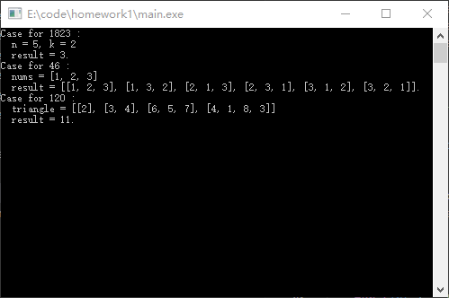
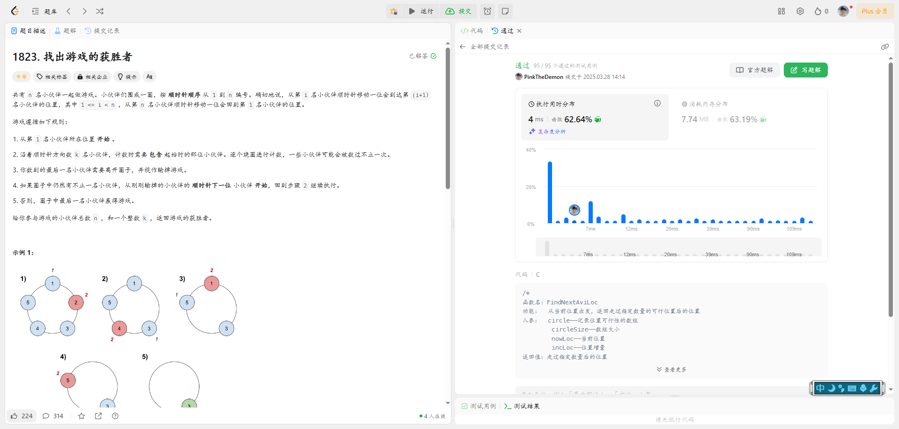
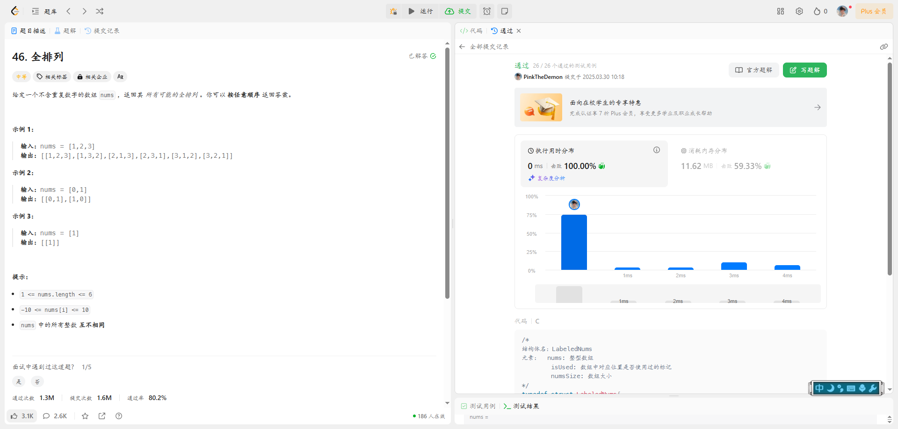
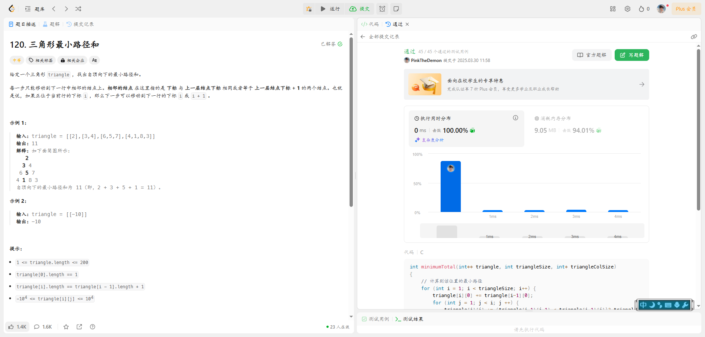
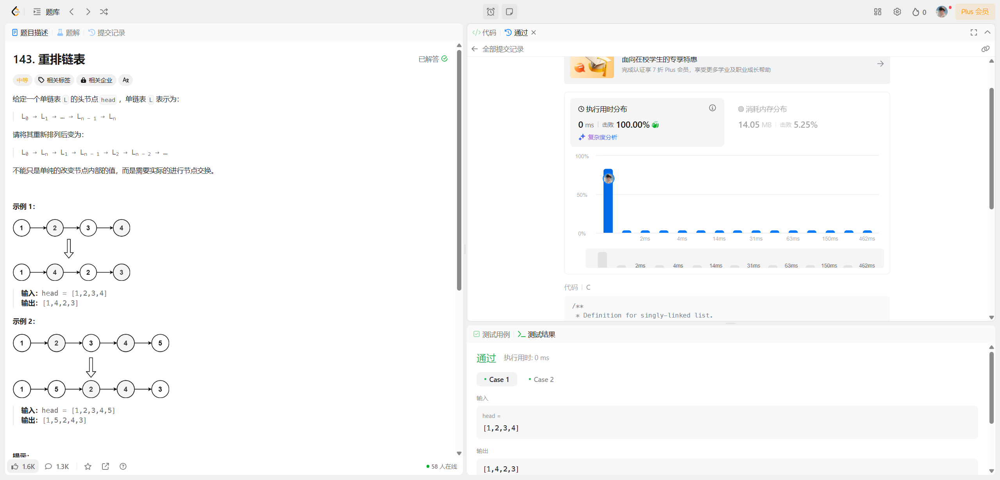
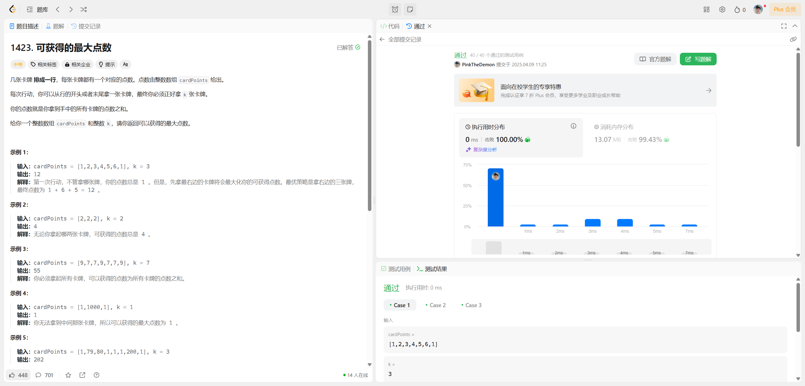
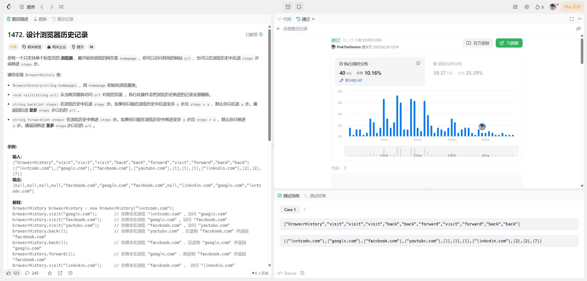

# 第一次作业

本次作业所有代码文件均包含在homework1文件夹中。

main.c中是所有题目的测试用例1的本地执行结果，main.exe是对应的可执行文件。

各个题目的代码分别在题号命名的.c文件中，将对应.c文件中的代码复制到力扣中提交即可通过（46题还需要将.h文件中的结构体定义一并复制进去）。

本地测试结果如下：

各题目的提交结果如下：

修改：

1、避免魔法数字（leetcode46.c 12行）；

2、删去不必要的空行；

3、指针变量的声明中，*号跟随变量名，而不是跟随类型名；

4、使用malloc函数时，无需强制类型转换；

5、同一个函数中进行多次内存开辟操作时，在检查第二个及以上内存开辟失败的操作中，需要对前面已经开辟的内存进行释放（leetcode46.c Permute函数）；

6、函数中开辟的内存，在函数结束之前注意释放（leetcode46.c Permute函数、leetcode1823.c FindTheWinner函数）；

7、二元操作符左右两边注意空格（leetcode142.c）

# 第二次作业

本次作业所有代码文件均包含在homework2文件夹中。

各题目代码分别在题号对应的.c文件中，由于力扣默认使用小驼峰的函数命名方法，因此将代码复制到力扣中时，需要将函数名的首字母全部改为小写。

各题目的提交结果如下：

